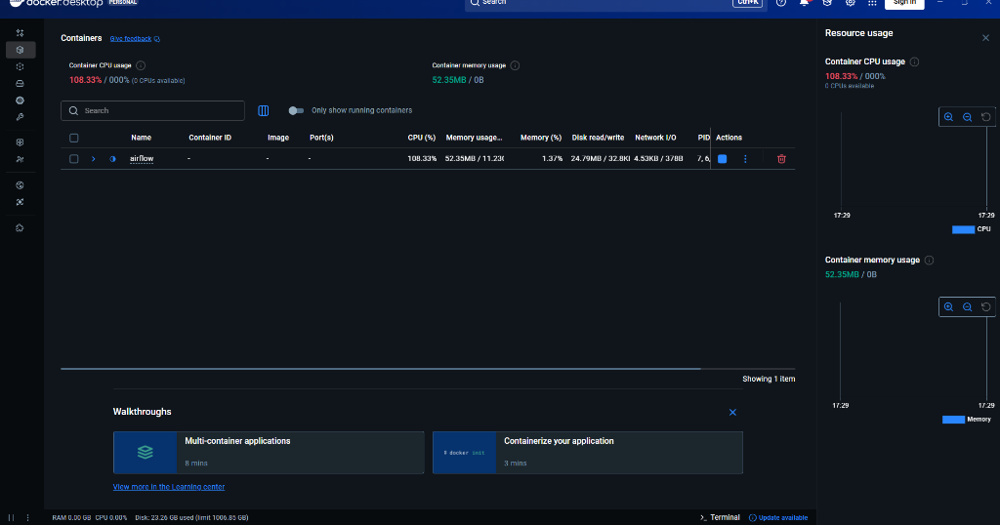

# T5 Sentiment Analysis MLOps Pipeline

This project implements an end-to-end MLOps pipeline for a custom **T5 Sentiment Analysis Model**. It features a specialized T5 Encoder with a "Sentiment Gate" architecture, deployed to **AWS SageMaker Serverless Inference**, and orchestrated by **Apache Airflow**.

<!--  -->

## 🚀 Key Features

*   **Custom Model Architecture**: Modified T5 Encoder with a Gating Mechanism (`T5ForSentimentClassification`) to dynamically weight hidden states for binary sentiment classification (SST-2 dataset).
*   **Serverless Deployment**: Deployed on **AWS SageMaker Serverless Inference** for cost-effective, on-demand scaling (pay-per-request).
*   **API Gateway Integration**: Publicly accessible REST API via **AWS API Gateway** and **AWS Lambda**.
*   **Automated MLOps**: Full pipeline orchestration using **Apache Airflow** in Docker, covering:
    *   Data Validation
    *   Model Training (with GPU support)
    *   Evaluation
    *   Model Packaging (`model.tar.gz`)
    *   Deployment (SageMaker & API Gateway)
    *   Endpoint Testing
    *   Email Notifications

## 📂 Project Structure

```
t5-aws-mlops-pipeline/
├── airflow/                 # Airflow configuration & DAGs
│   ├── dags/                # Pipeline definitions (t5_mlops_pipeline.py)
│   ├── docker-compose.yaml  # Airflow infrastructure
│   └── Dockerfile           # Custom Airflow image with AWS CLI & ML deps
├── aws_deploy/              # AWS Deployment Scripts
│   ├── code/                # Inference scripts (inference.py)
│   ├── deploy_sagemaker.py  # SageMaker deployment logic
│   ├── create_api_gateway.py# API Gateway & Lambda setup
│   └── package_model.py     # Artifact packaging
├── modules/                 # Core Model Code
│   ├── models/              # Custom T5 Architecture
│   ├── data/                # Data processing (SST-2)
│   └── training/            # Training loop
├── t5-classification/       # Model Artifacts (Local)
├── train.py                 # Training entry point
├── evaluate.py              # Evaluation entry point
└── requirements.txt         # Python dependencies
```

## 🛠️ Setup & Installation

### Prerequisites
*   **Docker Desktop** (running on Windows/Linux/Mac)
*   **AWS Account** with access keys
*   **Python 3.9+** (for local testing)

### 1. Configure Credentials
Create an `.env` file in the `airflow/` directory:
```bash
cp airflow/.env.example airflow/.env
```
Edit `airflow/.env` and add your AWS keys:
```env
AWS_ACCESS_KEY_ID=your_access_key
AWS_SECRET_ACCESS_KEY=your_secret_key
AWS_DEFAULT_REGION=us-east-1
AIRFLOW_UID=50000
```

### 2. Start Airflow
Run the following from the `airflow/` directory:
```bash
docker-compose up -d --build
```
Access the Airflow UI at [http://localhost:8080](http://localhost:8080) (User/Pass: `admin`/`admin`).

## 🏃‍♂️ Running the Pipeline

1.  **Trigger DAG**: In the Airflow UI, find `t5_mlops_pipeline`, unpause it, and click the **Play** button.
2.  **Workflow**:
    *   **Check Data**: Verifies dataset availability.
    *   **Check/Train Model**: Checks for a local model or trains a new one.
    *   **Package Model**: Compresses artifacts into `model.tar.gz`.
    *   **Deploy SageMaker**: Creates/Updates the Serverless Endpoint.
    *   **Create API Gateway**: Sets up the public HTTP API.
    *   **Test Endpoint**: Validates the live API.

## 🔌 API Usage

Once deployed, you can query the model via the API Gateway URL (found in the Airflow logs or AWS Console).

**Endpoint**: `POST https://<api-id>.execute-api.us-east-1.amazonaws.com/predict`

**Request Body**:
```json
{
  "inputs": "I absolutely loved this movie! It was fantastic."
}
```

**Response**:
```json
{
  "label": "POSITIVE",
  "score": 0.98
}
```

## 🧠 Model Details

The model uses a **T5-Small** encoder backbone. Instead of the standard decoder, it uses a custom **Sentiment Gate**:
1.  **Encoder**: Processes input text into hidden states.
2.  **Gate**: A learnable attention mechanism that weights the importance of each token's hidden state.
3.  **Classifier**: A dense layer that takes the weighted average of hidden states to predict sentiment (0 or 1).

## ☁️ AWS Architecture

*   **SageMaker**: Hosts the model artifacts in a serverless container.
*   **Lambda**: Acts as a proxy, receiving API requests and invoking the SageMaker endpoint.
*   **API Gateway**: Provides the public HTTP interface.
*   **S3**: Stores model artifacts (`model.tar.gz`).
